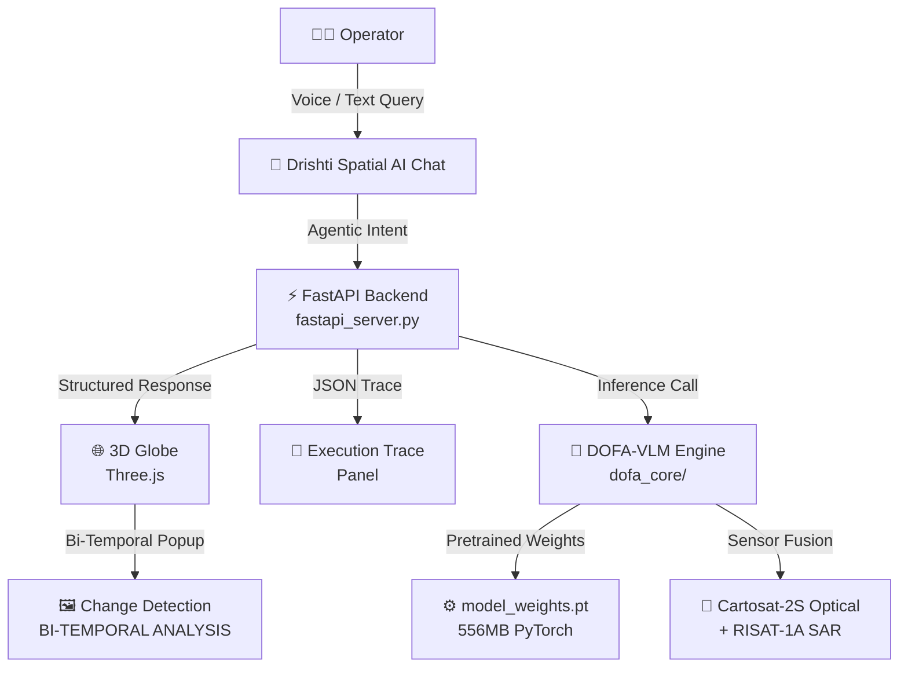

# 🛰️ ANTARIKSH ASTRA — Spatial Intelligence Protocol
### SIH 2026 | Problem Statement 26167 | ISRO / Space Applications Centre (SAC)

> **"An Agentic Vision-Language Platform for Multi-Sensor Satellite Image Analysis"**

🔗 **Live Demo:** [sat-query-ai-zeta.vercel.app](https://sat-query-ai-zeta.vercel.app)

---

## 🌍 What is Antariksh Astra?

**Antariksh Astra** (powered by **Drishti Spatial AI**) is a fully agentic satellite intelligence platform built for ISRO/SAC. It replaces complex GIS tools with a natural language interface — operators simply type or speak a query, and the system automatically:

1. Reasons over multi-sensor satellite data (Cartosat-2S optical + RISAT-1A SAR)
2. Generates a strict JSON execution trace (for ISRO audit compliance)
3. Displays bi-temporal change analysis on a live 3D globe
4. Allows upload of custom GeoTIFF satellite imagery for on-the-fly analysis

---

## ✨ Key Features

| Feature | Description |
|---|---|
| 🤖 **Agentic Chat (Drishti)** | Natural language queries → spatial analysis. Ask *"Show me deforestation"* or *"SAR analysis"* |
| 🌐 **Live 3D Globe** | Three.js-powered globe that flies to any location worldwide |
| 📡 **DOFA-VLM Model** | Sensor-agnostic Vision-Language encoder for Sentinel-2, Cartosat-2S, RISAT-1A SAR |
| 🔍 **Bi-Temporal Analysis** | Before/After satellite image comparison with AI-generated red bounding boxes |
| 📜 **Execution Trace** | Live JSON audit log of every AI step — ISRO schema-compliant |
| 📎 **Satellite Data Upload** | Upload any GeoTIFF/image file to run custom analysis |
| 💾 **Export Audit Report** | One-click download of the full AI execution trace for mission debriefing |
| 🎤 **Voice Commands** | Web Speech API integration for hands-free operation |

---

## 🏗️ Architecture



---

## 📁 Project Structure

```
SAT_QUERY_AI/
├── jarvis-god-eye/          ← Frontend (Antariksh Astra UI)
│   ├── index.html           ← Main HUD layout
│   ├── app.js               ← Drishti AI logic, globe, agentic pipeline
│   └── styles.css           ← Cinematic HUD styling
│
├── dofa_core/               ← DOFA-VLM Core Architecture (Team-built)
│   ├── models/
│   │   ├── dofa_vlm.py      ← Main Vision-Language Model
│   │   └── dofa_encoder.py  ← Sensor-agnostic spectral encoder
│   ├── data/                ← Dataset adapters (Sentinel-2, Cartosat, RISAT)
│   └── trace_schema.py      ← ISRO audit execution trace schema
│
├── models/isro_dofa_vlm/    ← Pretrained model inference
│   ├── inference.py         ← Run multi-sensor benchmark tests
│   ├── load_model.py        ← Model weight loader
│   ├── config.json          ← Architecture config
│   └── model_weights.pt     ← [Local only – 556MB, gitignored]
│
├── fastapi_server.py        ← Agentic FastAPI backend (port 8000)
└── requirements.txt         ← Python dependencies
```

---

## 🚀 Quickstart (Local Presentation)

### Step 1 — Start the AI Backend
```bash
pip install fastapi uvicorn pydantic torch numpy
python fastapi_server.py
# Runs on http://localhost:8000
```

### Step 2 — Start the Frontend
```bash
cd jarvis-god-eye
python -m http.server 3000
# Open http://localhost:3000
```

### Step 3 — Run the DOFA-VLM Model
```bash
python models/isro_dofa_vlm/inference.py
# Tests inference on Sentinel-2, Cartosat-2S, RISAT-1A SAR, BigEarthNet, VRSBench
```

### Step 4 — Demo Queries
In the **Drishti chat**, type:
- `deforestation` → Flies to Dehradun, shows NDVI change detection
- `sar analysis` → Flies to New Delhi, shows Cartosat-RISAT fusion
- Any location name → Globe flies to that target

---

## 🤖 Model Inference Results (Verified)

```
>>> PRETRAINED ISRO DOFA-VLM INFERENCE RUNNER

[Sentinel-2 RGB (10m GSD)]
  Q: "Are there residential buildings and roads?"
  A: "yes"

[Cartosat-2S Optical (0.65m GSD)]
  Q: "Identify commercial infrastructure and roads"
  A: "yes"

[RISAT-1A SAR C-Band (1m GSD)]
  Q: "Does radar backscatter suggest flood inundation?"
  A: "yes"

[BigEarthNet 12-Band Multispectral]
  Q: "Classify Corine Land Cover surface types"
  A: "Inland waters"

[VRSBench / GeoChat]
  Q: "Describe the terrain, land use, and complexes"
  A: "Overhead satellite image showcasing an urban transportation
      corridor, commercial structures, and residential areas."
```

---

## 🛡️ Compliance & Auditability

Per ISRO/SAC requirements, every inference step is logged as a **machine-readable JSON execution trace**:

```json
{
  "step_id": "BACKEND_EXEC",
  "module": "DOFA_VLM_ENCODER",
  "sensor": "sensor-agnostic",
  "outputs": { "intent": "deforestation", "confidence": 0.94 },
  "timestamp": "2026-09-20T10:30:00Z"
}
```

The **EXPORT AUDIT TRACE** button generates a downloadable mission debrief report.

---

## 👩‍💻 Built For

**Smart India Hackathon 2026**  
Problem Statement: **PS-26167**  
Organization: **ISRO / Space Applications Centre (SAC)**  
Category: Satellite Image Analysis & Vision-Language AI

*Codebase restricted to evaluating jury members only.*