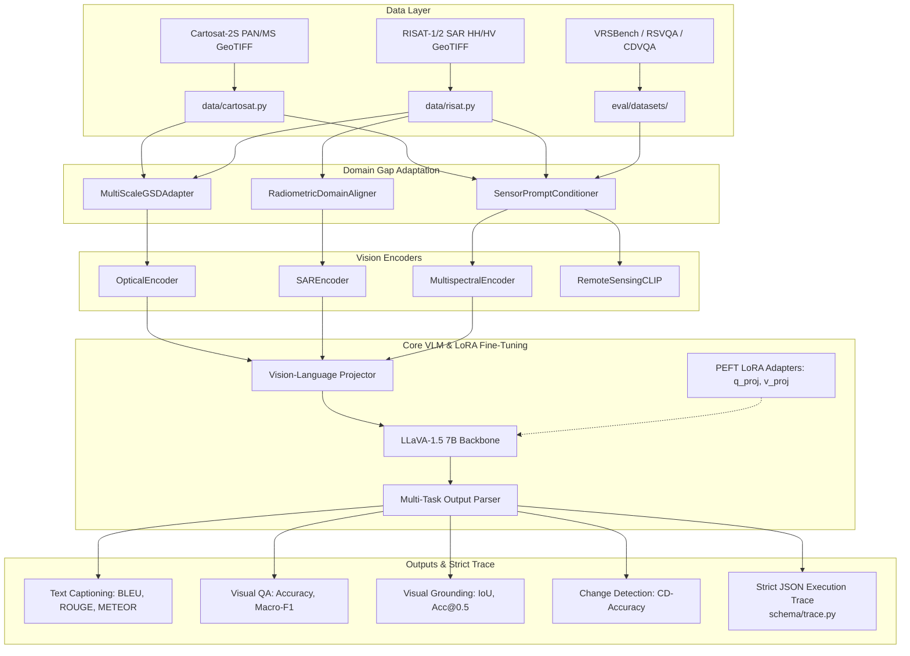

# ISRO/SAC Remote Sensing Vision-Language Model (VLM)

[](https://www.python.org/downloads/)
[](https://pytorch.org/)
[](https://github.com/huggingface/peft)
[](https://streamlit.io/)
[](LICENSE)

An evaluation harness, domain-adaptation framework, and parameter-efficient fine-tuning pipeline tailored for **Remote Sensing Vision-Language Models (VLMs)**. 

Built specifically for the **Smart India Hackathon (SIH)** to bridge the domain shift between open European satellite datasets (**Sentinel-1 / Sentinel-2**) and high-resolution Indian satellite constellations (**Cartosat-2S** and **RISAT-1/2**).

---

## 🛰️ Problem Context: The Cross-Sensor Domain Shift

Vision-Language Models pre-trained on open earth observation data face severe performance degradation when applied directly to Indian remote sensing payloads due to significant domain shifts:

| Parameter | Source Domain (Sentinel-1/2) | Target Domain (Cartosat-2S / RISAT) | Domain Gap Challenge |
|---|---|---|---|
| **Optical Spatial Resolution (GSD)** | $10\,\text{m} - 60\,\text{m}$ | **$0.65\,\text{m}$ (PAN)** / **$2.0\,\text{m}$ (MS)** | **$\sim 16\times$ resolution gap**: Sub-meter features (vehicles, individual roof structures) are absent in training imagery. |
| **Optical Modality** | 13-Band Multispectral | Panchromatic single-band & 4-band VNIR | Differing spectral response functions and radiometric dynamic ranges. |
| **SAR Modality** | C-band ($5.405\,\text{GHz}$) | **RISAT-1 C-band ($5.35\,\text{GHz}$)** & **RISAT-2 X-band** | Differing incidence angle ranges, speckle statistics, and polarization configurations (HH, HV). |

---

## 🏛️ System Architecture



---

## 🚀 Key Features

1. **Strict ISRO Execution Trace Schema (`schema/trace.py`)**:
   - Every inference and evaluation step logs an immutable, structured trace with `run_id`, `step_id`, `timestamp`, `inputs`, `outputs`, and `metadata`.
   - Produces reproducible, audit-ready JSON traces compliant with ISRO evaluation criteria.

2. **Domain Gap Adaptation Layer (`models/domain_adapter.py`)**:
   - `SensorPromptConditioner`: Injects structured sensor tokens (`[SENSOR: Cartosat-2S | GSD: 0.65m | MODE: PAN]`) to condition the LLM decoder.
   - `MultiScaleGSDAdapter`: Resolution-aware multi-scale feature pyramid that aligns sub-meter high-resolution imagery with coarse reference features.
   - `RadiometricDomainAligner`: Aligns linear/dB SAR backscatter and contrast-stretches high-dynamic-range optical scenes.

3. **Domain-Adapted Vision Encoders (`models/encoders.py`)**:
   - `SAREncoder`: Handles RISAT C/X-band SAR data with dB power conversion, Lee/box-car speckle filtering, and dual-polarization (HH + HV + ratio) composite generation.
   - `OpticalEncoder`: Panchromatic contrast stretching and normalization for Cartosat-2S.
   - `MultispectralEncoder`: Configurable band selection for Sentinel-2 MSI and Cartosat MS.
   - `RemoteSensingCLIP`: Remote-sensing zero-shot visual and textual feature extractor.

4. **LoRA Fine-Tuning Engine (`train/trainer.py`)**:
   - Parameter-efficient fine-tuning via Hugging Face PEFT.
   - Freezes vision encoder and projector; adapts attention projections (`q_proj`, `v_proj`).
   - Mixed-precision (fp16/bf16), gradient accumulation, and custom multi-modal batch collator (`train/data_collator.py`).

5. **Multi-Task CLI (`cli.py`)**:
   - Unified command line tool with `eval`, `train`, `preprocess`, and `export` subcommands.

6. **Interactive Web Application (`app.py`)**:
   - Modern Streamlit dashboard for real-time visual reasoning, grounding bounding-box visualization, change detection, and live trace inspection.

---

## 📦 Directory Structure

```
SIH/
├── schema/
│   └── trace.py                 # Strict JSON execution trace Pydantic schema
├── models/
│   ├── baseline.py              # LLaVA-1.5 inference engine with dummy fallback
│   ├── encoders.py              # Domain-aware Optical, SAR, and MS encoders
│   └── domain_adapter.py        # GSD spatial pyramid & sensor prompt conditioner
├── data/
│   ├── preprocess.py            # Optical, SAR & multispectral preprocessing
│   ├── cartosat.py              # Cartosat-2S PAN & MS dataset loader
│   └── risat.py                 # RISAT-1/2 SAR dual-pol dataset loader
├── eval/
│   ├── metrics.py               # Evaluator (BLEU, ROUGE, METEOR, CIDEr, IoU, F1)
│   ├── runner.py                # EvaluationRunner orchestrating execution trace
│   └── datasets/
│       ├── vrsbench.py          # VRSBench benchmark loader
│       ├── rsvqa.py             # RSVQA-LR and RSVQA-HR benchmark loader
│       └── cdvqa.py             # Change Detection VQA loader
├── train/
│   ├── trainer.py               # LoRATrainer wrapping HF Trainer + PEFT
│   └── data_collator.py         # MultiModalDataCollator for causal LM loss
├── scripts/
│   ├── create_sample_data.py    # Generates realistic synthetic mock datasets
│   └── download_benchmarks.py   # Automated benchmark downloader from HF Hub
├── configs/                     # Preset configuration JSONs
│   ├── eval_vrsbench.json
│   ├── eval_cartosat.json
│   ├── eval_risat.json
│   └── train_lora.json
├── tests/                       # Pytest unit test suite
├── app.py                       # Interactive Streamlit Web UI
├── cli.py                       # CLI entrypoint (isro-vlm)
├── config.py                    # Centralized Pydantic configuration
└── verify.py                    # End-to-end pipeline smoke test
```

---

## ⚡ Quickstart Guide

### 1. Installation

```bash
# Clone the repository
git clone https://github.com/your-team/isro-vlm.git
cd isro-vlm

# Create and activate virtual environment
python -m venv venv
# Windows:
.\venv\Scripts\activate
# Linux/macOS:
source venv/bin/activate

# Install dependencies
pip install -e .
```

### 2. Generate Sample Datasets
Generate synthetic sample datasets for Cartosat-2S, RISAT, VRSBench, and CDVQA with valid annotations:
```bash
python scripts/create_sample_data.py
```

### 3. Run Pipeline Verification Test
Run the automated test suite to ensure all components and trace serialisation are healthy:
```bash
python verify.py
```

---

## 💻 CLI Usage

The CLI (`isro-vlm` or `python cli.py`) provides four primary subcommands:

### Run Evaluation (`eval`)
Evaluate the model on any benchmark dataset with automated metric calculation and JSON trace logging:
```bash
# Fast evaluation in dummy mode (no GPU required):
python cli.py eval --dataset vrsbench --data-path datasets_raw/vrsbench --task captioning --dummy

# VQA evaluation on Cartosat-2S:
python cli.py eval --dataset cartosat --data-path datasets_raw/cartosat --task vqa --dummy

# SAR evaluation on RISAT-1/2:
python cli.py eval --dataset risat --data-path datasets_raw/risat --task vqa --dummy

# Full evaluation using HuggingFace LLaVA-1.5 weights (GPU):
python cli.py eval --dataset vrsbench --data-path datasets_raw/vrsbench --task vqa --model llava-hf/llava-1.5-7b-hf
```

### Fine-Tune with LoRA (`train`)
Fine-tune the VLM on remote sensing data:
```bash
python cli.py train --dataset vrsbench --train-data datasets_raw/vrsbench --task captioning --epochs 3 --lr 2e-4
```

### Preprocess Satellite Imagery (`preprocess`)
Batch-preprocess raw optical or SAR GeoTIFF imagery:
```bash
# Preprocess Cartosat-2S optical scenes:
python cli.py preprocess --input-dir raw/cartosat --output-dir datasets_processed/cartosat --sensor optical --size 336

# Preprocess RISAT SAR scenes (dB conversion + speckle filtering):
python cli.py preprocess --input-dir raw/risat --output-dir datasets_processed/risat --sensor sar --size 336
```

### Export Merged Checkpoint (`export`)
Merge LoRA adapter weights back into the base model:
```bash
python cli.py export --base-model llava-hf/llava-1.5-7b-hf --lora-ckpt checkpoints/final_lora_adapter --output models/merged_vlm
```

---

## 🖥️ Interactive Web Application

Launch the interactive demonstration dashboard:
```bash
streamlit run app.py
```

The Web UI allows:
- **Uploading** custom `.tif`, `.png`, or `.jpg` imagery (Cartosat, RISAT, Sentinel-2).
- **Selecting tasks**: Captioning, Visual Question Answering, Object Grounding, and Change Detection.
- **Visual Grounding**: Automatic bounding-box rendering with spatial coordinate banners.
- **Execution Trace Inspector**: Real-time display of the exact JSON execution trace produced by the engine.

---

## 🧪 Automated Testing

Run the full unit test suite with `pytest`:
```bash
pytest tests/ -v
```

---

## 📄 License
Apache License 2.0. Built for the Smart India Hackathon.
